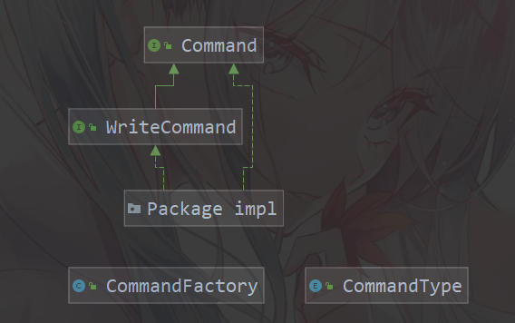
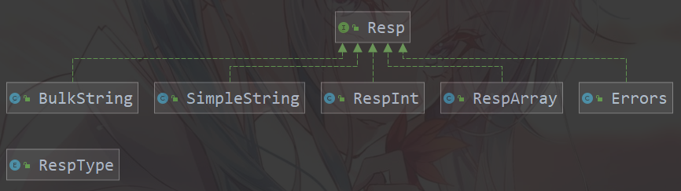

# RESP协议-命令解析流程

本文介绍 程序支持的RESP命令 并 详细阐述处理流程:

- client 
  - Ping
  - Quit
  - Select
- hash 
  - Hset
  - Hscan
  - Hdel
- key 
  - Del
  - Exists
  - Expire
  - Keys
  - Scan
  - Ttl
  - Type
- list 
  - Lpush
  - Lrange
  - Lrem
  - Rpush
- set
  - Sadd
  - Srem
  - Sscan
- String
  - Decr
  - Get
  - Incr
  - Mget
  - Mset
  - Set
  - SetEx
  - SetNx
- zset
  - Zadd
  - Zrem
  - Zrevrange
- 主从复制 (待实现)
  - sync
  - psync

## 命令解析过程:

### 命令结构:

#### 服务端命令结构:



- Command 包含:

  - type method: 获取命令类型
  - setContent method: 设置命令参数
  - handle method: 处理命令逻辑(操作 cache 存储key-value)
  - WriteCommand 用于实现 数据持久化 与 主从复制 (待开发)

-  CommandType 枚举类:

  - 定义支持的命令类型, 使用构造方法作为枚举参数
  - 与 CommandFactory 互补, 构建命令对象

  ```java
  // Connection（连接）
      auth(Auth::new), ping(Ping::new), quit(Quit::new), select(Select::new),
      // Hash（哈希表）
      hdel(Hdel::new), hscan(Hscan::new), hset(Hset::new),
      // Key（键）
      del(Del::new), exists(Exists::new), expire(Expire::new), keys(Keys::new), scan(Scan::new), ttl(Ttl::new), type(Type::new),
      // List（列表）
      lpush(Lpush::new), lrange(Lrange::new), lrem(Lrem::new), rpush(Rpush::new),
      // Server（服务器）
      client(Client::new), config(Config::new), info(Info::new),
      // Set（集合）
      sadd(Sadd::new), srem(Srem::new), sscan(Sscan::new),
      // String（字符串）
      decr(Decr::new), get(Get::new), incr(Incr::new), mget(Mget::new), mset(Mset::new), set(Set::new), setex(SetEx::new), setnx(SetNx::new),
      // SortedSet（有序集合）
      zadd(Zadd::new), zrem(Zrem::new), zrevrange(Zrevrange::new);
  
  ```

  

- CommandFactory 工厂类:

  - 根据 Resp 参数, 返回合适的 Command 实例,  调用 Command.handle 方法 完成 cache 操作.

#### 传输层命令结构:



> netty-all 本身实现了一套 RESP 编解码器, 参考其代码效果更好.
>
> 实际开发时, 不该自己编写 RESP 格式转换过程.

[RESP 协议](https://redis.io/docs/reference/protocol-spec/)

- RespType 定义 RESP 协议内特殊符号

```java
ERROR((byte) '-'),
    STATUS((byte) '+'),
    BULK((byte) '$'),
    INTEGER((byte) ':'),
    MULTYBULK((byte) '*'),
    R((byte) '\r'),
    N((byte) '\n'),
    ZERO((byte) '0'),
    ONE((byte) '0'),;
```

- 实体类与其对应含义
  - 内置命令位于首位(eg: get set 等), 作为类型判断依据
  - SimpleString 对应 Simple Strings
  - BulkString 对应 Bulk Strings
  - RespArray 对应 Arrays
  - RespInt 对应 Integers
  - Errors 对应 Errors
- Resp 接口:
  - write 方法: 将数据从 Resp 格式 编码为 Resp字节流,并写入 缓冲区
  - decode 方法: 解析字节流, 并将数据转化为 Resp 格式
  - 通过 netty 责任链模式, 将编解码流程应用到数据传输过程中.

