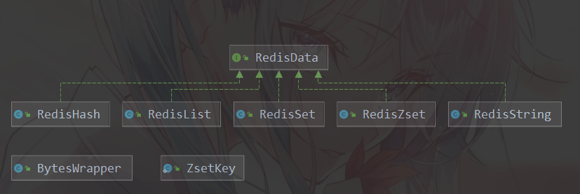
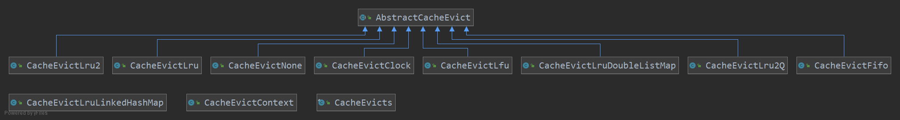
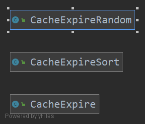
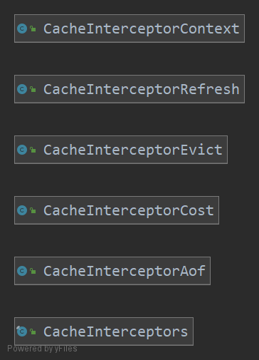
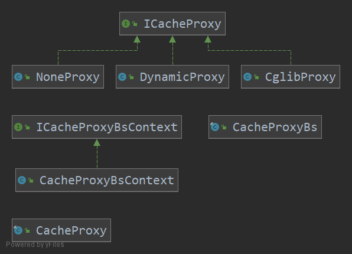
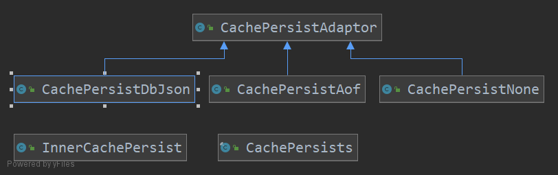
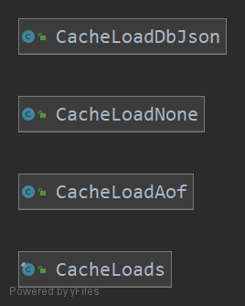
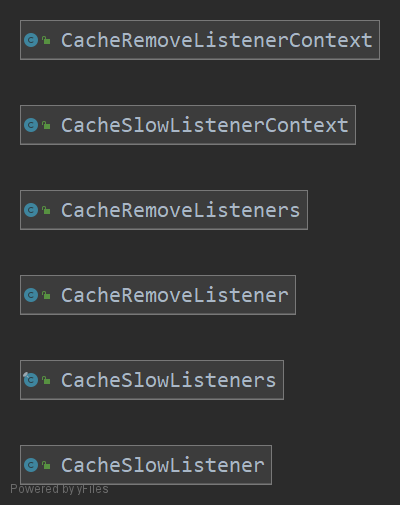

# ICache 缓存概述

## 基础数据结构:



- BytesWrapper : key 值, 使用 byte[] 存储
- RedisHash: 存储 Hash 类型数据
- RedisList: 存储 List 型数据
- RedisSet: 存储 set 型数据
- RedisString: 存储 String 型数据
- RedisZset: 排序表, 使用红黑树(TreeMap 实现)

## key 淘汰策略实现方式:



Redis 淘汰机制为:

- 每次新写入数据时, 若存储空间不足, 淘汰符合策略的 key

其中可能涉及到预留内存, 防止淘汰热点数据, 多队列淘汰等复杂算法, 对这些实现进行了简化.

使用声明 key 数量的方式, 限制缓存上限

使用直观的 FIFO LRU LFU 等淘汰算法.

- AbstractCacheEvict 淘汰策略 method 定义类
- CacheEvictFifo ... 各种淘汰策略实现类

## key 过期策略实现方式:



Redis 提供了两种 过期Key 删除策略:

- 定期删除, 启动一个线程, 每隔一段时间随机删除一部分过期 key, 将过期key的数量维持在 合理的水平
- 惰性删除, 访问某key时, 判断key是否过期, 若过期, 删除目标key 并 返回 null.

具体实现类详解:

- CacheExpire 缓存过期-普通策略:

  - 使用额外的存储空间 记录可能过期的 key

  ```java
  Map<K, Long> expireMap = new HashMap<>();
  ```

  - 限制单次最多清除 100 条过期 key.
  - 使用 ScheduledExecutorService 实现定时任务功能

- CacheExpireSort 緩存过期-时间排序策略:

  - 在 CacheExpire 缓存策略的基础上, 额外增加按照时间排序的 Map

  ```java
  private final Map<Long, List<K>> sortMap = new TreeMap<>(new Compare() {
  	public int compare(Long o1,Long o2) {
  		return (int)(o1-o2);
  	}
  })
  ```

  - 执行定时删除任务时, 只需判断最近过期key 是否过期即可, 避免无用的轮询操作

- CacheExpireRandom 缓存过期-随机清除策略:

  - 引入了 redis 缓存清理 快慢模式, 解决过期key太多太大, 导致程序阻塞问题
  - 引入 随机获取 key 方法, 避免程序内存在 "活过期key"

## 功能扩展-拦截器



- CacheInterceptors 拦截器工具类
  - 构造默认的 拦截器实例
- ICacheInterceptorContext 拦截器上下文信息:
  - 作为构造拦截器的依据
- CacheInterceptorAof: aof 持久化拦截器
- CacheInterceptorCost: 耗时统计拦截器
- CacheInterceptorEvict: 驱除策略拦截器
- CacheInterceptorRefresh: 惰性过期拦截器

### 拦截器实现原理 -- 代理模式



- ICacheProxy : 缓存代理接口
  - Object proxy() 方法
- NoneProxy: 不使用代理
- DynamicProxy:  使用 java Proxy 代理类, 
  - 通过CacheProxyBsContext 内定义的拦截器, 对目标方法进行增强
- CglibProxy: 使用 Cglib 实现代理模式
  - 大同小异 
- CacheProxy: 构造代理后的对象, 并返回

## 持久化策略实现方式:



### 持久化数据

适配器模式:

- CachePersistAdaptor 缓存持久化-适配器
  - 定义 persist方法, 规定了持久化后数据的格式 
- CachePersistAof 缓存持久化-AOF 模式
  - 逻辑写入文件 // TODO 为支持 主从复制, 需要修改为 网络传输
- CachePersistDbJson 缓存持久化-rdb-基于 JSON 实现
  - TODO 编写 netty 支持的版本
- CachePersistNone 不进行持久化
- CachePersists 缓存持久化工具

### 加载数据



- CacheLoads 加载持久化信息工具
- CacheLoadNone 无加载策略
- CacheLoadDbJson 加载 RDB 持久化文件 //TODO 一次读取全部文件, 可能存在性能问题
- CacheLoadAof : 使用类似 IoC 扫描注解的方式实现:
  - 为了识别需要进行持久化的命令(set/expire等需要持久化; get等不需要持久化), 引入注解进行配置
    - @CacheInterceptor 自定义注解 判断是否开启对应功能
    - 代理模式实现调用

## 监听器实现策略



逻辑比较简单 不细说了